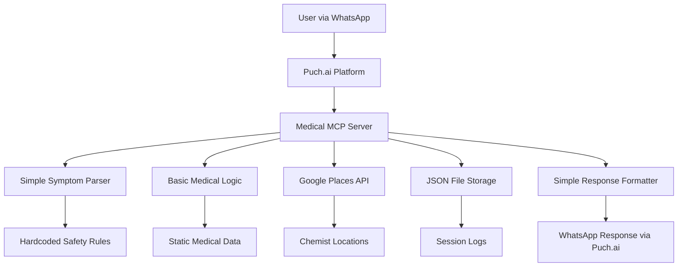

# 🏥 Medical Assistant MCP Server - MVP

> **A Simple Medical First-Aid MCP Server for Puch.ai Hackathon**  
> MVP: Connect Puch.ai to basic medical guidance with symptom triage and OTC suggestions

[](https://modelcontextprotocol.io/)
[](https://python.org)
[](https://fastapi.tiangolo.com/)

---

## 🎯 **MVP Scope (30+ Hours Remaining)**

This MVP MCP server provides **basic medical assistance** through Puch.ai with:

-   ✅ **Simple symptom analysis** (basic triage logic)
-   💊 **Safe OTC suggestions** (paracetamol, basic medicines)
-   🏠 **Basic home remedies** (hardcoded safe suggestions)
-   🌍 **Chemist location** (Google Places integration)
-   📝 **Basic logging** (simple JSON storage)
-   ⚠️ **Safety disclaimers** (always present)

**🚀 MVP Goal**: Get a working demo connecting Puch.ai to medical MCP tools within 30 hours!

### ⚠️ **Important Medical Disclaimer**

> This is an **informational tool only**. Not a substitute for professional medical advice.
> For emergencies, call your nearest hospital or emergency services (102/108 in India).

---

## 🏗️ **Simple MVP Architecture**



**MVP Focus**: Keep it simple, get it working, then iterate!

---

## 🛠️ **Simple MVP Tech Stack**

| Component      | Technology       | Purpose                | Complexity |
| -------------- | ---------------- | ---------------------- | ---------- |
| **Server**     | Python + FastAPI | MCP Server             | ⭐⭐       |
| **Storage**    | JSON Files       | Simple session logging | ⭐         |
| **Medical AI** | Hardcoded Rules  | Basic symptom analysis | ⭐         |
| **Maps**       | Google Places    | Find nearby chemists   | ⭐⭐       |
| **Protocol**   | MCP (JSON-RPC)   | Connect to Puch.ai     | ⭐⭐⭐     |
| **Safety**     | Static Rules     | Emergency detection    | ⭐         |

**🎯 MVP Strategy**: Start with ⭐ complexity, add ⭐⭐ features, skip ⭐⭐⭐ for now

---

## ⚡ **MVP Quick Start (15 Minutes)**

### 1️⃣ **Setup Project**

```bash
# Create project directory
mkdir medical-mcp-mvp && cd medical-mcp-mvp

# Create virtual environment
python -m venv venv
source venv/bin/activate  # Windows: venv\Scripts\activate

# Create basic structure
mkdir src data tests
touch src/main.py src/config.py .env
```

### 2️⃣ **Install Basic Dependencies**

```bash
# Create requirements.txt with MVP essentials
cat > requirements.txt << EOF
fastapi==0.104.1
uvicorn[standard]==0.24.0
mcp==1.0.0
googlemaps==4.10.0
python-dotenv==1.0.0
pydantic==2.5.0
EOF

# Install
pip install -r requirements.txt
```

### 3️⃣ **Basic Configuration**

```bash
# Create .env file
echo "GOOGLE_PLACES_API_KEY=your_key_here" > .env
echo "DEBUG=true" >> .env
echo "PORT=8000" >> .env
```

### 4️⃣ **Quick Test**

```bash
# Start with a simple "Hello MCP" server first
python src/main.py

# Test basic connectivity
curl http://localhost:8000/health
```

**⏰ Next**: Create the basic MCP tools (see implementation steps below)

---

## 📁 **Simple MVP Structure**

```
medical-mcp-mvp/
├── 📄 README.md                    # This guide
├── 📄 requirements.txt             # Essential dependencies only
├── 📄 .env                         # API keys
├── 📁 src/
│   ├── 📄 main.py                  # Main MCP server (start here!)
│   ├── 📄 config.py                # Basic settings
│   └── 📄 medical_data.py          # Hardcoded medical data
├── 📁 data/
│   ├── 📄 medicines.json           # Simple OTC medicine list
│   ├── 📄 remedies.json            # Basic home remedies
│   └── 📄 sessions.json            # User session logs
└── 📁 tests/
    └── 📄 test_basic.py            # Essential tests only
```

**🎯 Start with just `main.py` and `config.py` → Add others as needed**

---

## 🔧 **MVP Tools (Priority Order)**

### 🎯 **Phase 1: Core Tools (Must Have)**

| Tool               | Description             | Complexity | Time Est. |
| ------------------ | ----------------------- | ---------- | --------- |
| `analyze_symptoms` | Basic symptom → triage  | ⭐         | 2 hours   |
| `suggest_medicine` | Simple OTC suggestions  | ⭐         | 1 hour    |
| `get_remedies`     | Hardcoded home remedies | ⭐         | 30 mins   |

### 🎯 **Phase 2: Enhanced Tools (Nice to Have)**

| Tool              | Description               | Complexity | Time Est. |
| ----------------- | ------------------------- | ---------- | --------- |
| `find_chemists`   | Google Places integration | ⭐⭐       | 3 hours   |
| `emergency_check` | Red flag detection        | ⭐⭐       | 2 hours   |
| `log_session`     | Simple JSON logging       | ⭐         | 1 hour    |

**🚀 Start with Phase 1, add Phase 2 if time permits**

---

## 🎮 **Usage Examples**

### Example 1: Basic Symptom Analysis

```python
# User input: "I have fever since 2 days, feeling weak"
# MCP Tool Call:
{
  "tool": "analyze_symptoms",
  "params": {
    "symptoms": "fever, weakness",
    "duration": "2 days",
    "age": "adult"
  }
}

# Response:
{
  "triage_level": "self_care",
  "suggestions": {
    "otc_medicines": [
      {"name": "Paracetamol", "dose": "500mg", "frequency": "every 6-8h"}
    ],
    "home_remedies": ["rest", "hydration", "cool compress"],
    "youtube_link": "https://youtube.com/fever-care"
  },
  "warning": "If fever >103°F or persists >3 days, see doctor"
}
```

### Example 2: Emergency Detection

```python
# User: "Chest pain and difficulty breathing"
# MCP automatically detects red flags:
{
  "triage_level": "emergency",
  "action": "immediate_medical_attention",
  "message": "🚨 EMERGENCY: Call 102/108 immediately",
  "nearest_hospitals": [...],
  "escalation": "alert_sent_to_doctor"
}
```

### Example 3: Find Chemists

```python
# User: "Where can I buy paracetamol nearby?"
{
  "tool": "find_nearby_chemists",
  "params": {"location": "user_location", "medicine": "paracetamol"}
}

# Response:
{
  "chemists": [
    {
      "name": "Apollo Pharmacy",
      "distance": "0.5 km",
      "maps_link": "https://maps.google.com/...",
      "phone": "+91-...",
      "open_now": true
    }
  ]
}
```

---

## 🛡️ **Safety & Compliance**

### 🚨 **Red Flag Symptoms** (Auto-escalation)

-   High fever (>103°F/39.4°C)
-   Difficulty breathing
-   Severe chest pain
-   Unconsciousness
-   Severe bleeding
-   Signs of stroke/heart attack

### 💊 **OTC-Only Policy**

-   **Allowed**: Paracetamol, Ibuprofen, ORS, Antacids
-   **Forbidden**: Prescription drugs, Schedule H medicines
-   **Safety**: Adult dosages only, with age restrictions

### 📋 **Consent Management**

-   One-time consent capture
-   Data retention: 30 days (hackathon)
-   Encrypted PHI storage
-   Audit logs for all decisions

---

## 🚀 **30+ Hour MVP Sprint Plan**

### **Phase 1: Foundation (8 hours)**

-   [ ] **Hours 1-2**: Setup project + basic FastAPI server
-   [ ] **Hours 3-4**: Create simple MCP structure + health endpoint
-   [ ] **Hours 5-6**: Implement basic symptom analysis tool
-   [ ] **Hours 7-8**: Add OTC medicine suggestion tool

### **Phase 2: Core Features (10 hours)**

-   [ ] **Hours 9-11**: Add home remedies tool with static data
-   [ ] **Hours 12-14**: Integrate Google Places for chemist search
-   [ ] **Hours 15-16**: Basic emergency detection (red flags)
-   [ ] **Hours 17-18**: Simple session logging

### **Phase 3: Integration (8 hours)**

-   [ ] **Hours 19-22**: Connect to Puch.ai MCP interface
-   [ ] **Hours 23-24**: Test with WhatsApp integration
-   [ ] **Hours 25-26**: Add safety disclaimers and error handling

### **Phase 4: Polish & Demo (6+ hours)**

-   [ ] **Hours 27-29**: Fix bugs, improve responses
-   [ ] **Hours 30-32**: Create demo script and test flows
-   [ ] **Hours 33+**: Record demo, prepare submission

**⚡ MVP Success = Working Puch.ai connection + 3 basic medical tools**

---

## 🧪 **MVP Testing Strategy**

### **Quick Manual Tests**

```bash
# Test server health
curl http://localhost:8000/health

# Test basic MCP tool
curl -X POST http://localhost:8000/mcp \
  -H "Content-Type: application/json" \
  -d '{"method": "analyze_symptoms", "params": {"symptoms": "fever headache"}}'

# Test Puch.ai integration
# (Use Puch.ai test interface)
```

### **Essential Safety Checks**

-   [ ] Emergency keywords trigger safety warnings
-   [ ] Only safe OTC medicines are suggested
-   [ ] All responses include medical disclaimers
-   [ ] No prescription drugs in suggestions

**🎯 Focus on functional testing, skip complex unit tests for MVP**

---

## 📈 **MVP Success Metrics**

| Metric                | MVP Target             | Measurement   |
| --------------------- | ---------------------- | ------------- |
| **Demo Works**        | ✅ Basic tools respond | Manual test   |
| **Puch.ai Connected** | ✅ MCP integration     | Live demo     |
| **Safety First**      | ✅ Disclaimers present | Code review   |
| **Response Time**     | <5s                    | Basic timing  |
| **Core Features**     | 3+ working tools       | Feature count |

**🎯 MVP Goal: Functional demo > Perfect metrics**

---

## 🌐 **MVP API Endpoints**

| Endpoint  | Method | Description             | Priority |
| --------- | ------ | ----------------------- | -------- |
| `/health` | GET    | Basic health check      | ⭐⭐⭐   |
| `/mcp`    | POST   | Main MCP tool interface | ⭐⭐⭐   |
| `/test`   | GET    | Quick test page         | ⭐⭐     |

**🎯 Start with just `/health` and `/mcp` - that's all you need!**

---

## 🤝 **Contributing**

1. **Fork** the repository
2. **Create** feature branch: `git checkout -b feature/new-tool`
3. **Commit** changes: `git commit -m 'Add new medical tool'`
4. **Push** to branch: `git push origin feature/new-tool`
5. **Submit** pull request

### **Development Guidelines**

-   Follow medical safety protocols
-   Add tests for all new tools
-   Document all medical references
-   Use type hints throughout

---

## 📄 **License & Legal**

-   **Code**: MIT License
-   **Medical Content**: Informational only, not medical advice
-   **APIs**: Respect rate limits and terms of service
-   **Privacy**: HIPAA-compliant data handling

---

## 🆘 **Support & Contact**

-   **Issues**: [GitHub Issues](https://github.com/your-username/medical-mcp-server/issues)
-   **Discord**: [Puch.ai Community](https://discord.gg/puch-ai)
-   **Email**: medical-mcp@your-domain.com

---

## 🏆 **MVP Submission Checklist**

### **Demo Requirements**

-   [ ] Server starts without errors
-   [ ] Basic MCP tools respond correctly
-   [ ] Puch.ai integration works
-   [ ] Safety disclaimers are present
-   [ ] Emergency detection functions

### **Submission Package**

-   [ ] Working code repository
-   [ ] Basic README with setup instructions
-   [ ] Demo video (2-3 minutes)
-   [ ] Live demo URL (if hosted)

**Team**: [Your Team Name]  
**Repo**: `https://github.com/yourusername/medical-mcp-mvp`  
**Demo**: [Record on Loom/YouTube]

> 🚀 Built in 30+ hours for Puch.ai Hackathon 2025  
> MVP: Simple medical assistance through MCP

---

**⭐ Good luck with your MVP! Focus on functionality over perfection!**

# puch.ai-hack-mcp
