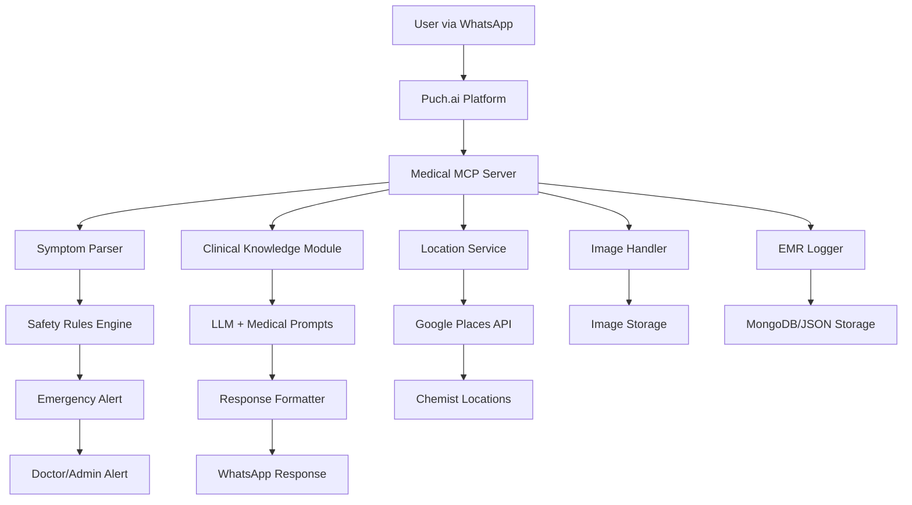

# 🏥 Medical Assistant MCP Server

> **A Medical First-Aid MCP Server for Puch.ai Hackathon**  
> Connect AI assistants to medical knowledge for safe triage, OTC suggestions, home remedies, and chemist locations

[](https://modelcontextprotocol.io/)
[](https://python.org)
[](https://fastapi.tiangolo.com/)

---

## 🎯 **Project Overview**

This MCP (Model Context Protocol) server enables AI assistants to provide **safe medical guidance** including:

-   ✅ **Symptom triage** (Self-care / See doctor / Emergency)
-   💊 **OTC medicine suggestions** with safe dosages
-   🏠 **Home remedies** with YouTube video links
-   🏪 **Nearest chemist/pharmacy locations**
-   📝 **Structured EMR logging** with consent management
-   🚨 **Emergency escalation** for serious symptoms

### ⚠️ **Important Medical Disclaimer**

> This is an **informational tool only**. Not a substitute for professional medical advice.
> For emergencies, call your nearest hospital or emergency services (102/108 in India).

---

## 🏗️ **Architecture Overview**



---

## 🛠️ **Tech Stack**

| Component    | Technology         | Purpose                    |
| ------------ | ------------------ | -------------------------- |
| **Server**   | Python + FastAPI   | MCP Server Implementation  |
| **Database** | MongoDB/SQLite     | EMR & Session Storage      |
| **NLU**      | spaCy + Regex      | Symptom Extraction         |
| **LLM**      | Azure OpenAI/Local | Medical Knowledge & Triage |
| **Maps**     | Google Places API  | Chemist Location           |
| **Storage**  | Local/S3           | Image & File Storage       |
| **Protocol** | MCP (JSON-RPC)     | AI Integration Standard    |

---

## ⚡ **Quick Start (5 Minutes)**

### 1️⃣ **Clone & Setup**

```bash
git clone https://github.com/your-username/medical-mcp-server.git
cd medical-mcp-server

# Create virtual environment
python -m venv venv
source venv/bin/activate  # On Windows: venv\Scripts\activate

# Install dependencies
pip install -r requirements.txt
```

### 2️⃣ **Environment Configuration**

```bash
cp .env.example .env
# Edit .env with your API keys:
# - GOOGLE_PLACES_API_KEY=your_key
# - OPENAI_API_KEY=your_key (optional)
# - MONGODB_URI=mongodb://localhost:27017 (optional)
```

### 3️⃣ **Run the Server**

```bash
# Development mode
python -m uvicorn src.main:app --reload --port 8000

# Test the server
curl -X POST http://localhost:8000/health
```

### 4️⃣ **Connect to Puch.ai**

```json
// In your Puch.ai MCP configuration
{
    "medical_assistant": {
        "type": "http",
        "url": "http://localhost:8000/mcp",
        "headers": {
            "Authorization": "Bearer your-token"
        }
    }
}
```

---

## 📁 **Project Structure**

```
medical-mcp-server/
├── 📄 README.md                    # This file
├── 📄 requirements.txt             # Python dependencies
├── 📄 .env.example                 # Environment template
├── 📄 docker-compose.yml           # Local development
├── 📁 src/
│   ├── 📄 main.py                  # FastAPI MCP Server
│   ├── 📄 medical_tools.py         # Medical MCP Tools
│   ├── 📄 symptom_parser.py        # NLU & Symptom Extraction
│   ├── 📄 clinical_knowledge.py    # Medical Logic & LLM
│   ├── 📄 location_service.py      # Chemist Finder
│   ├── 📄 safety_rules.py          # Red Flag Detection
│   ├── 📄 emr_logger.py            # Patient Data Storage
│   └── 📄 config.py                # Settings & Constants
├── 📁 tests/
│   ├── 📄 test_medical_tools.py    # Unit Tests
│   └── 📄 test_safety_rules.py     # Safety Testing
├── 📁 data/
│   ├── 📄 otc_medicines.json       # Safe Medicine Database
│   ├── 📄 home_remedies.json       # Remedy Templates
│   └── 📄 red_flags.json           # Emergency Symptoms
└── 📁 docs/
    ├── 📄 API.md                   # API Documentation
    ├── 📄 SAFETY.md                # Medical Safety Guidelines
    └── 📄 DEPLOYMENT.md             # Production Setup
```

---

## 🔧 **MCP Tools Available**

### 🩺 **Medical Tools**

| Tool                    | Description                   | Example Usage              |
| ----------------------- | ----------------------------- | -------------------------- |
| `analyze_symptoms`      | Parse symptoms → triage level | "fever, headache, 2 days"  |
| `suggest_otc_medicine`  | Safe OTC recommendations      | "pain relief for headache" |
| `get_home_remedies`     | Natural remedies + YouTube    | "cold and cough remedies"  |
| `find_nearby_chemists`  | Locate pharmacies             | "chemists near me"         |
| `check_emergency_signs` | Red flag detection            | "difficulty breathing"     |
| `log_consultation`      | Save EMR with consent         | Patient session logging    |

### 📊 **Data Resources**

| Resource            | Description            | Format                     |
| ------------------- | ---------------------- | -------------------------- |
| `patient_history`   | Previous consultations | JSON EMR                   |
| `medicine_database` | OTC drug information   | Structured data            |
| `remedy_library`    | Home treatments        | Video links + instructions |

---

## 🎮 **Usage Examples**

### Example 1: Basic Symptom Analysis

```python
# User input: "I have fever since 2 days, feeling weak"
# MCP Tool Call:
{
  "tool": "analyze_symptoms",
  "params": {
    "symptoms": "fever, weakness",
    "duration": "2 days",
    "age": "adult"
  }
}

# Response:
{
  "triage_level": "self_care",
  "suggestions": {
    "otc_medicines": [
      {"name": "Paracetamol", "dose": "500mg", "frequency": "every 6-8h"}
    ],
    "home_remedies": ["rest", "hydration", "cool compress"],
    "youtube_link": "https://youtube.com/fever-care"
  },
  "warning": "If fever >103°F or persists >3 days, see doctor"
}
```

### Example 2: Emergency Detection

```python
# User: "Chest pain and difficulty breathing"
# MCP automatically detects red flags:
{
  "triage_level": "emergency",
  "action": "immediate_medical_attention",
  "message": "🚨 EMERGENCY: Call 102/108 immediately",
  "nearest_hospitals": [...],
  "escalation": "alert_sent_to_doctor"
}
```

### Example 3: Find Chemists

```python
# User: "Where can I buy paracetamol nearby?"
{
  "tool": "find_nearby_chemists",
  "params": {"location": "user_location", "medicine": "paracetamol"}
}

# Response:
{
  "chemists": [
    {
      "name": "Apollo Pharmacy",
      "distance": "0.5 km",
      "maps_link": "https://maps.google.com/...",
      "phone": "+91-...",
      "open_now": true
    }
  ]
}
```

---

## 🛡️ **Safety & Compliance**

### 🚨 **Red Flag Symptoms** (Auto-escalation)

-   High fever (>103°F/39.4°C)
-   Difficulty breathing
-   Severe chest pain
-   Unconsciousness
-   Severe bleeding
-   Signs of stroke/heart attack

### 💊 **OTC-Only Policy**

-   **Allowed**: Paracetamol, Ibuprofen, ORS, Antacids
-   **Forbidden**: Prescription drugs, Schedule H medicines
-   **Safety**: Adult dosages only, with age restrictions

### 📋 **Consent Management**

-   One-time consent capture
-   Data retention: 30 days (hackathon)
-   Encrypted PHI storage
-   Audit logs for all decisions

---

## 🚀 **40-Hour Hackathon Roadmap**

### **Day 1 (20 hours)**

-   [x] **Hours 1-4**: Setup project structure + basic MCP server
-   [x] **Hours 5-8**: Implement symptom parser + safety rules
-   [x] **Hours 9-12**: Clinical knowledge module + LLM integration
-   [x] **Hours 13-16**: EMR logging + consent flow
-   [x] **Hours 17-20**: Basic testing + MVP demo

### **Day 2 (20 hours)**

-   [ ] **Hours 21-24**: Google Places API + chemist finder
-   [ ] **Hours 25-28**: Response formatter + WhatsApp integration
-   [ ] **Hours 29-32**: Image handling + basic triage
-   [ ] **Hours 33-36**: Load testing + performance optimization
-   [ ] **Hours 37-40**: Final polish + presentation prep

---

## 🧪 **Testing**

```bash
# Run all tests
pytest tests/ -v

# Test specific components
pytest tests/test_safety_rules.py -v
pytest tests/test_medical_tools.py -v

# Load testing (simulate 100 concurrent users)
python scripts/load_test.py
```

### **Safety Test Cases**

-   [ ] Red flag symptoms trigger emergency response
-   [ ] OTC suggestions never include prescription drugs
-   [ ] Dosage recommendations include age restrictions
-   [ ] All medical advice includes disclaimers

---

## 📈 **Metrics for Puch.ai Leaderboard**

| Metric                     | Target        | Current |
| -------------------------- | ------------- | ------- |
| **Queries served/hour**    | 1000+         | -       |
| **Automated triage %**     | 80%+          | -       |
| **Chemist click-throughs** | 60%+          | -       |
| **Emergency escalations**  | 100% accuracy | -       |
| **User satisfaction**      | 4.5/5         | -       |
| **Response time**          | <3s           | -       |

---

## 🌐 **API Endpoints**

| Endpoint          | Method | Description          |
| ----------------- | ------ | -------------------- |
| `/health`         | GET    | Server health check  |
| `/mcp`            | POST   | Main MCP interface   |
| `/metrics`        | GET    | Performance metrics  |
| `/admin/sessions` | GET    | EMR sessions (admin) |

---

## 🤝 **Contributing**

1. **Fork** the repository
2. **Create** feature branch: `git checkout -b feature/new-tool`
3. **Commit** changes: `git commit -m 'Add new medical tool'`
4. **Push** to branch: `git push origin feature/new-tool`
5. **Submit** pull request

### **Development Guidelines**

-   Follow medical safety protocols
-   Add tests for all new tools
-   Document all medical references
-   Use type hints throughout

---

## 📄 **License & Legal**

-   **Code**: MIT License
-   **Medical Content**: Informational only, not medical advice
-   **APIs**: Respect rate limits and terms of service
-   **Privacy**: HIPAA-compliant data handling

---

## 🆘 **Support & Contact**

-   **Issues**: [GitHub Issues](https://github.com/your-username/medical-mcp-server/issues)
-   **Discord**: [Puch.ai Community](https://discord.gg/puch-ai)
-   **Email**: medical-mcp@your-domain.com

---

## 🏆 **Hackathon Submission**

**Team**: [Your Team Name]  
**Submission**: [Puch.ai/hack submission link]  
**Demo**: [Live demo URL]  
**Video**: [YouTube demo video]

> Built with ❤️ for the Puch.ai Hackathon 2024  
> Making AI-powered healthcare accessible to everyone

---

**⭐ Star this repo if it helps you build amazing medical AI assistants!**
